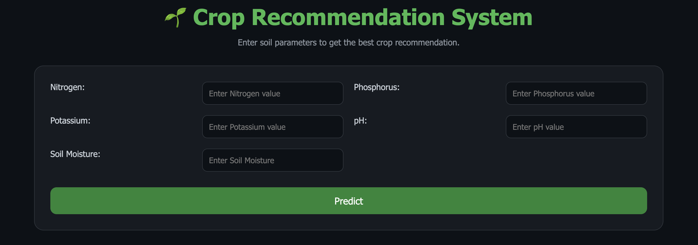

# 🌱 AgriTech Decision Support System

An AI-powered **AgriTech Dashboard** built using **Flask** and **Machine Learning** that recommends the most suitable crop based on soil conditions and provides valuable agricultural insights such as fertilizer recommendations, soil health analysis, irrigation advice, disease risk detection, and profit estimation.

---

# 📸 Application Preview

## 🏠 Home Page



---

## 📊 Dashboard


---

# ✨ Features

- 🌱 AI-Based Crop Recommendation
- 🧪 Soil Nutrient Analysis
- 💚 Soil Health Score
- 🌿 Fertilizer Recommendation
- 💧 Irrigation Advice
- ⚠️ Disease Risk Detection
- 💰 Profit Estimation
- 📊 Interactive NPK Chart (Chart.js)
- 📝 Input Summary Dashboard
- 🌙 Modern Responsive Dark UI

---

# 🚀 Why This Project?

Most crop recommendation projects stop after predicting a crop.

This project goes beyond prediction by providing a complete **Decision Support Dashboard** that helps users understand:

- Which crop is best suited for the given soil.
- Soil nutrient condition.
- Soil health score.
- Recommended fertilizers.
- Estimated crop revenue.
- Disease risk based on soil conditions.
- Irrigation requirements.

This makes the application more practical and closer to a real-world AgriTech solution.

---

# 🛠 Tech Stack

| Category | Technologies |
|----------|--------------|
| **Backend** | Python, Flask |
| **Machine Learning** | Scikit-learn, Pandas |
| **Frontend** | HTML5, CSS3, JavaScript |
| **Visualization** | Chart.js |
| **Model** | Random Forest Classifier |

---

# ⚙️ Project Workflow

```text
                User Input
                     │
                     ▼
          Machine Learning Model
                     │
                     ▼
        Crop Recommendation
                     │
      ┌──────────────┼──────────────┐
      ▼              ▼              ▼
 Crop Details   Soil Analysis   Profit Estimation
      │              │              │
      ▼              ▼              ▼
Disease Risk   Irrigation     Fertilizer Advice
                     │
                     ▼
          Interactive Dashboard
```

---

# 📂 Project Structure

```text
AgriTech-Decision-Support-System
│
├── data/
├── models/
│   └── crop_model.pkl
│
├── screenshots/
│   ├── home.png
│   └── dashboard.png
│
├── static/
│   └── style.css
│
├── templates/
│   └── index.html
│
├── app.py
├── train.py
├── test_model.py
├── requirements.txt
├── runtime.txt
└── README.md
```

---

# ⚡ Installation

### Clone the repository

```bash
git clone https://github.com/Rohan26096/AgriTech-Decision-Support-System.git
```

### Move into the project directory

```bash
cd AgriTech-Decision-Support-System
```

### Install dependencies

```bash
pip install -r requirements.txt
```

### Run the application

```bash
python app.py
```

### Open your browser

```
http://127.0.0.1:5001
```

---

# 📈 Current Features

✅ Crop Recommendation

✅ Fertilizer Recommendation

✅ Soil Health Analysis

✅ Soil Nutrient Analysis

✅ Irrigation Recommendation

✅ Disease Risk Detection

✅ Profit Estimation

✅ Interactive Dashboard

✅ Input Summary

✅ Dark Theme UI

---

# 🔮 Future Improvements

- 🌦️ Live Weather API Integration
- 📄 PDF Report Generation
- 🗂️ Prediction History using SQLite
- 📍 Region-Based Crop Recommendation
- 📱 Mobile Responsive Dashboard
- ☁️ Cloud Deployment
- 📈 Crop Yield Prediction

---

# 🎯 Applications

This project can be useful for:

- 👨‍🌾 Farmers
- 🌾 Agriculture Consultants
- 🎓 Students
- 🤖 Machine Learning Projects
- 💼 Portfolio & Resume
- 🚀 Internship Demonstrations

---

# 🤝 Contributing

Contributions are welcome.

If you would like to improve this project:

1. Fork the repository
2. Create a new branch
3. Commit your changes
4. Open a Pull Request

---

# 👨‍💻 Author

**Rohan**

- GitHub: https://github.com/Rohan26096

---

# ⭐ Support

If you found this project helpful, consider giving it a ⭐ on GitHub.

It helps the project reach more developers and motivates future improvements.